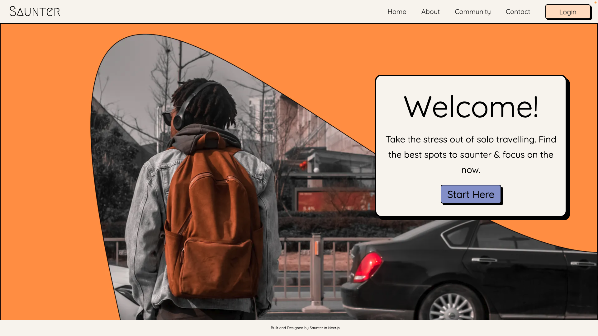

# Saunter - The Solo Travelling App 🐾
Click on the image below to view our app's trailer!
<br/>
<a href="https://www.youtube.com/watch?v=OjcGonZyPS0" target="_blank">
 
</a>
</br>
Hello, we're Team Saunter. We created this app as our School of Code final four week project(Bootcamp 12, 25 April - 16th August 2022).
<br/>
<br/>

## List of Contents
1. [Meet The Team](#meet-the-team)
2. [The Problem](#the-problem)
3. [The Solution](#our-solution)
4. [How Our App Works](#how-our-app-works)
5. [Features](#features)
6. [Tech Stack](#tech-stack)
7. [Getting Started](#getting-started)
8. [Running Tests](#running-tests)
9. [What Went Well](#what-went-well)
10. [Challenges](#challenges)
11. [Key Takeaways](key-takeaways)
12. [Appendix](#appendix)

# Meet the Team
- [Anastasia Starostina](https://github.com/anastasia-starostina)
- [Emily Vickery](https://github.com/Emily9903)
- [Fabian Deckmann Fjaervik](https://github.com/ffjaervik)
- [Mogool Maya Abas Bafo](https://github.com/MogoolMayaB)
- [Owen Ahmed](https://github.com/owenowenson)
- [Sadie Goddard](https://github.com/Sadie109)

# The Problem
As a team with mixed experiences of travelling alone, we found that current travelling apps are often not tailored to solo travellers. These apps often focus on mainstream attractions rather than smaller, independent businesses, and user personalisation is often limited. Other apps utilise wish list systems, but do not allow the user to save iteneraries or create personalised day plans. Creating iteneraries can be stressful for those travelling alone and can impact negatively on their travelling experience.

# Our Solution
We decided to create a app to enable solo travellers to create saved day plans from a selection of attractions, from larger landmarks to smaller businesses. We endeavoured to make this app as streamlined and easy to navigate as possible for the user to minimise the friction of solo travelling.

We have implemented a filtration system that allows users to narrow down their activity options. These filters include those not commonly seen on other travelling apps such as energy level (low, medium and high) and whether the location is dog friendly, whilst still remaining simple for the user to navigate 

# How Our App Works
Our app opens with a boldly styled home screen, with options to log in and to click through to our Get-Started page. From here, the user can filter the kinds of activities they wish to see, and be sent to a new page to view a personalised selection of activities on a carousel, pulled from our database. They have the option to change their filters, favourite activities for later or to add activities to their final day plan. Once all chosen activities have been selected, the user will be redirected to their own personalised and unique day plan, complete with descriptions of each activity and links to view on Google Maps. 

Day plans can be created with or without logging in, but if the user chooses to log in, they are also able to access a user page containing favourited activities and previously saved day plans. 

# Features
- Login and Authorisation through Auth0
- Filtration System to Personalise Activity Results 
- Interactive Carousel to View Results
- Plus Icon to Add Chosen Activities
- Heart Icon to Favourite Activities
- Links to Google Maps for Activities
- Personalised Day Plan with Activity Descriptions and Links to Google Maps
- Option to Save and Name Day Plan on a Pop Out Screen
- User Page to View Favourited Activities and Previously Saved Day Plans (When Logged In) 
- All Activity Options Stored in Database 
- Saved Day Plans Stored in Database
- Bold Neobrutalist Inspired Styling Throughout

# Tech Stack
- Client: Next.js, CSS, Chakra UI, React Icons, Vercel
- Server: Node.js, PostgreSQL, Axios, Heroku, Postman, Express
- Client-Side Testing: Jest, React Testing Library, Cypress
- Server-Side Testing: SuperTest, Mocha
- Authorisation: Auth0
- Deployment: Vercel
# Getting Started

## Front-End

View our deployed front-end here: https://final-project-front-end-team-saunter.vercel.app/

To run the front-end locally follow the steps below:

- Git clone the front-end repository by pasting the following into your terminal:

```bash
  git clone https://github.com/SchoolOfCode/final-project_front-end-team-saunter.git
```

- Install all required dependencies by running:

```bash
  npm i
```

- Start the app using the following:

```bash
  npm run dev
```

## Back-End

The back-end is deployed on Heroku, however if you would like to run locally you will need to follow the steps below:

- Git clone the back-end repository by pasting the following into your terminal:

```bash
  git clone https://github.com/SchoolOfCode/final-project_back-end-team-saunter.git
```

- Install all required dependencies by running:

```bash
  npm i
```

- To run the server locally use the following script within your terminal:

```bash
  npm run dev
```

# Running Tests
To run front-end testing, ensure you have installed dependencies using npm i (see above) and then run the following:

```bash
  npm run test
```

# What Went Well
- During this project we were very proud of how well we worked together as a team. We maintained a positive and supportive atmosphere with clear communication and a great feeling of psychological safety within the group. 
- Team members were able to try and learn new technologies such as Next.js, and were able to work on multiple areas of the project through regular switching of smaller teams.
- We utilized our Trello board very effectively throughout the project, enabling clarity for team members around tickets and what our goals were for each sprint.

# Challenges

- One of the main challenges we experienced was around defining our next steps after the initial MVP was complete and we had received user feedback. When working through this we spent a day reviewing and editing our MoSCoW board and redesigning our wireframes, ensuring that all voices and opinions were heard and that no decisions were made without the full agreement of the group.
- After having difficulties with refactoring and editing several different UI carousels, we decided to create our own from scratch to allow for more freedom and personalisation in our app.
- We experienced some bugs and issues during both our front-end and back-end deployments, which we were able to resolve through studying the Heroku and Vercel documentation carefully.
- Finally, we were able to make our app partially responsive for use on smaller devices, however due to time constraints we were not able to complete this.

# Key Takeaways
- One key takeaway from this project is to allow extra time for unexpected bugs and issues, as these can take longer than expected to resolve.
- Another takeaway was to spend more time during the planning stage to detail the stretch goals and wireframes before creating the initial MVP.
- As a team we became more comfortable with asking for help when needed over the course of the four weeks
- All team members learned and developed many skills during the project, and the risks that were taken by using new technologies such as Next.js and our bold app styling proved to be the right decisions.


# Appendix
Please find resources below for further guidance:
- [Next.js](https://nextjs.org/docs/getting-started)
- [Auth0](https://auth0.com/docs/)
- [Chakra Component Library](https://chakra-ui.com/getting-started)
- [React Icons](https://react-icons.github.io/react-icons/) 
- [Vercel](https://vercel.com/docs) 
- [Node.js](https://nodejs.org/en/docs/)
- [PostgreSQL](https://www.postgresql.org/docs/)
- [Heroku](https://devcenter.heroku.com/)
- [Postman](https://learning.postman.com/docs/getting-started/introduction/)
- [Express](https://expressjs.com/en/resources/glossary.html)
- [Jest](https://jestjs.io/docs/getting-started)
- [ReactTesting Library](https://testing-library.com/docs/react-testing-library/intro/)
- [Cypress](https://docs.cypress.io/guides/overview/why-cypress)
- [SuperTest](https://docs.npmjs.com/getting-started)
